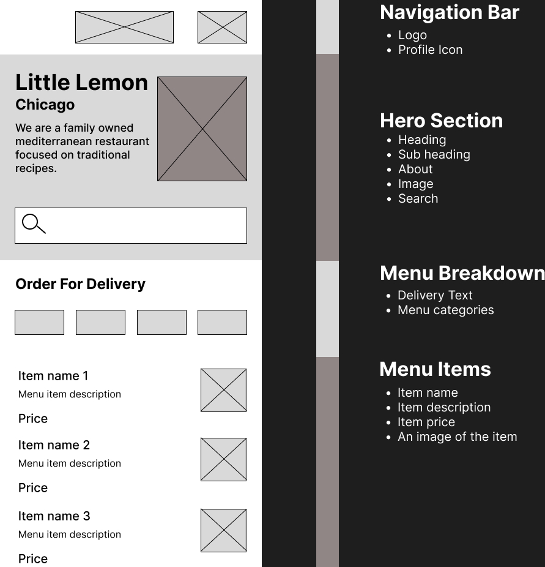
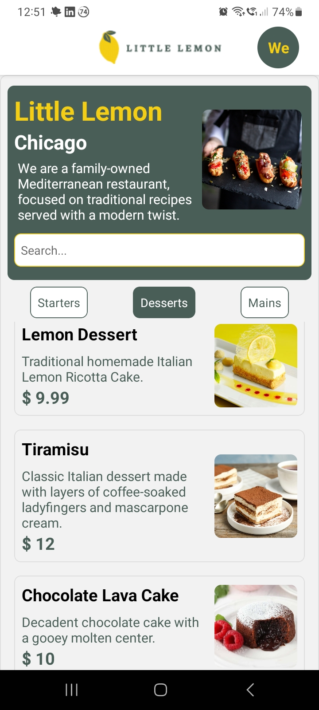
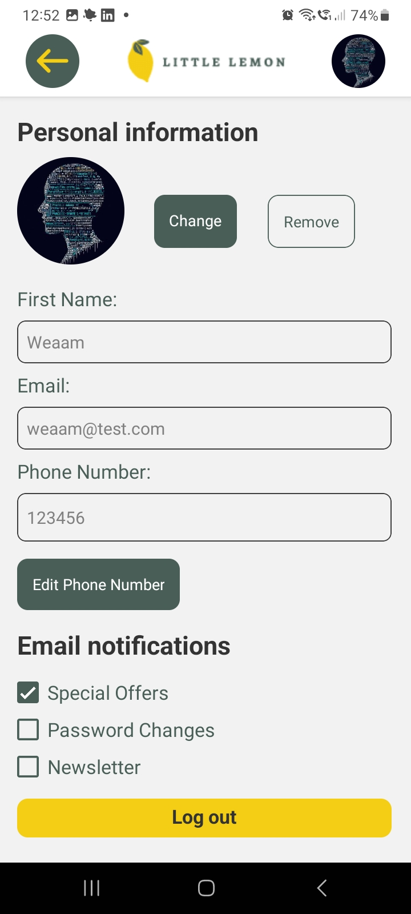

Little Lemon React Native Mobile App - Capstone
----------------------------------

Welcome to the Little Lemon Mobile App Capstone Project! This React Native app streamlines takeout orders for Adrian's Little Lemon restaurant.

### Project Highlights

*   **UI Excellence:** Intuitive and visually appealing User Interface (UI) for a great user experience.
    
*   **Code Quality:** Clean and bug-free coding practices for smooth performance.
    
*   **React Components:** Modular and efficient codebase using React components.
    
*   **Cross-Platform Development:** Developed with React Native for wider accessibility.
    
*   **User Onboarding:** User-friendly onboarding flow to enhance engagement.
    
*   **Data Management:** Utilized fetch API and SQLite for seamless data retrieval and storage.
    

### Acquired Skills
    
*   **UX/UI Design:** Applied principles for appealing and user-centric design.
    
*   **React Framework:** Expertise in React for dynamic and responsive interfaces.
    
*   **SQLite Database:** Skilled in local data storage and retrieval.
    
*   **Figma Design:** Used Figma for visually appealing interfaces.

## Screenshots

### Home Screen

### Profile Screen

